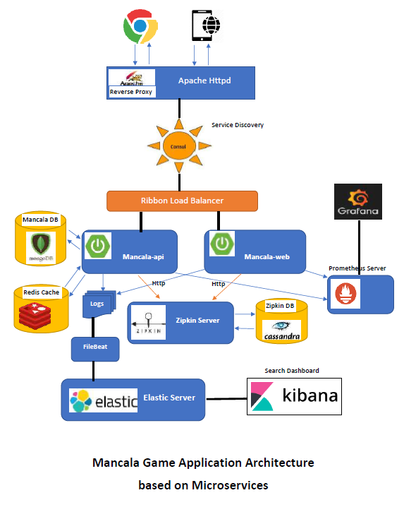
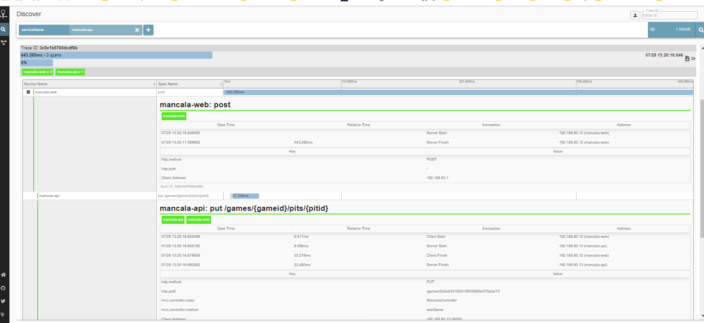
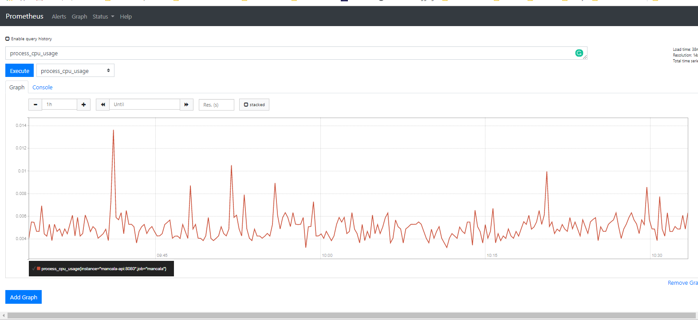
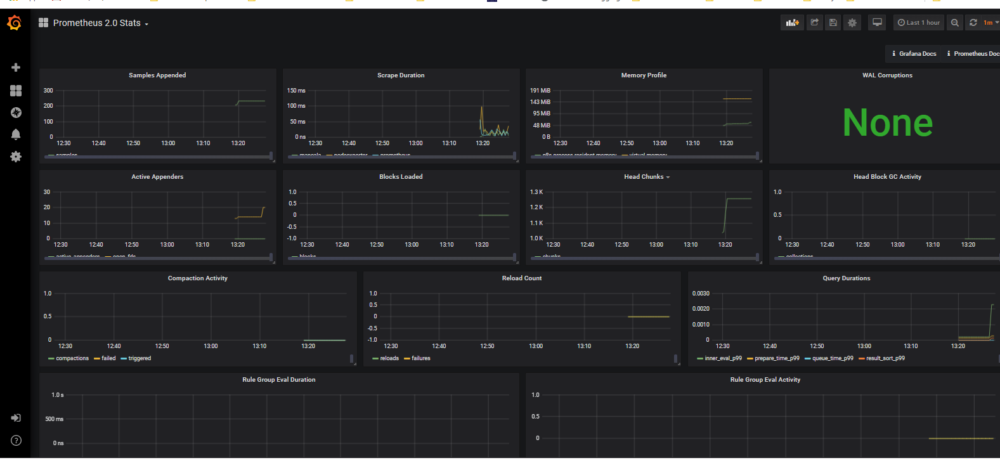
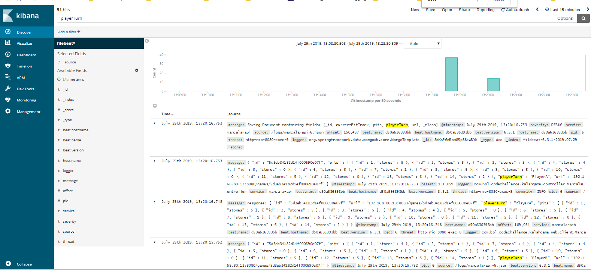

# Mancala Game implementation based on Microservices architecture

This application implements Kalaha Game (See [Mancala Game Definition](./pictures/mancala-game-def.png))


The complete walk-through tutorial about this implementation provided in the series of articles I've published here:
 
 [Building Mancala Game in Microservices using Spring Boot (Part 1)](https://dzone.com/articles/mancala-game-implementation-using-microservices-ap)
 
 [Building Mancala Game in Microservices using Spring Boot (Part 2)](https://dzone.com/articles/building-mancala-game-in-microservices-using-sprin)
 
 [Building Mancala Game in Microservices using Spring Boot (Part 3)](https://dzone.com/articles/building-mancala-game-in-microservices-using-sprin-1)
 
 [Building Mancala Game in Microservices using Spring Boot (Part 4)](https://dzone.com/articles/building-mancala-game-in-microservices-using-sprin-2)
 

The solution uses Microservices architecture for building the game mostly for demonstration purposes!

The implementation consists of two microservices implemented in Java using Spring Boot and Spring Cloud:
                                                 
 -   `mancala-api`: A TDD based implementation of Mancala Game API with two endpoints:
     
        - `CreateGame Endpoint`: To create a new Game
        - `SowGame Endpoint`: To sow specific pit index of the Game 
        
        You can find several Tests created to make sure the implementation covers all possible cases within Kalah Game.
 
 -   `mancala-web`: provides a simple User interface as a web application to consume Manacala API
   
Technologies
------------
- `Spring Boot`
- `Spring Cloud`, used for building Microservics applications in Java
- `Spring MVC`, for creating RESTful API
- `Vaadin`, A modern UI components for building web applications in Java 
- `MongoDB`, NoSQL database for persisting the Game information
- `Redis`, Key-Value in-memory data structure for caching the Game instances
- `Cassandra`, distributed NoSQL database used as Zipkin storage 
- `Docker`, for containerization of services
- `Docker-Compose`, to link the containers
- `Consul`, service lookup/discovery
- `Ribbon`, client load balancing
- `Apache Httpd`, request routing and http load balancer.
- `Swagger`, Swagger-UI, for API documentation
- `Micrometer`, Spring boot default metrics export engine 
- `Actuator`, Monitoring the app, gathering metrics, understanding traffic
- `Spring Sleuth`, distributed tracing solution for Spring Cloud
- `Zipkin`, distributed tracing system for tracing service calls and visualizing the traces.
- `WireMock`, inter-service communication testing
- `Spring Cloud Contract`, Contract Based Testing for Microservices

Solution Architecture
--
The overal architecture of Mancala Game weill be as below:




Consul
--

 This application uses [Hashicorp Consul](https://www.consul.io) for service registry/discovery and Apache httpd as a reverse proxy to 
 route the calls to the services and as a load balancer. All the Spring Cloud microservices (mancala-api, mancala-web) register
 themselves in the Consul server.
 
 Consul has a Web UI. You can access it at port 8500 of your Docker host and there is also a link at homepage of this 
 application directing you to the Consul web UI.
 

Apache HTTP Load Balancer
------------------------
Apache HTTP is used to provide the web page of the application at
port 80. It also forwards HTTP requests to the microservices whose ports
are not exposed! Apache HTTP is configured as a reverse proxy for this - and
as a load balancer i.e. if you start multiple instances of a microservices
e.g. via `docker-compose scale mancala-api=3`, Apache will recognize the new instances.
```
[.\mancal-game\docker]

    docker-compose scale mancala-api=3
```       


Swagger API Documentation
------------------------
Swagger provides documentation for API. You can check the Mancala Game API at home page.


Zipkin
-----

[Zipkin](http://zipkin.io/) is a tool to trace calls across
microservices. Distributed Tracing can be used to measure the performance of the microservices. 
In this application, you can access Zipkin dashboard to trace calls between `mancala-web` and `Mancala-api` 
microservices. These microservices are configured to provide trace information. 



You can access Zipkin at <http://localhost:9411>


Prometheus
-----

[Prometheus](https://prometheus.io/) is an open-source monitoring system with a dimensional data model, flexible query language, efficient time series database and modern alerting approach.

In this application, microservices are configured to send metrics to Prometheus server for monitoring which can be seen at  <http://localhost:9090> 



There is also a better tool for monitoring called [Grafana](https://grafana.com/) which can be used to have better visualization on collected metrics provided by Prometheus server.
 
 You can access to Grafana dashboard at <http://localhost:3000>


   
   
ELK Stack
-----
["ELK"](https://www.elastic.co) is the acronym for three open source projects: Elasticsearch, Logstash, and Kibana which together provides centralized search and analytical solution to our application.
 
In this application, we have configured Filebeat to send logs generated by our Microservices to Logstash which in turn are transferred to Elastic search server.

You can access to Kibana dashboard at <http://localhost:5601>

After you configure the Kibana dashboard, you can search on Logs for any data collected by our application, e.g. 'PlayerTurn' to see how playerTurn parameter has changed over several `Mancala-api` calls to sow() Endpoint.
 



 How To Run
 ----------
 
 Before building the game, there is an environment variable called `MANCALA_PIT_STONES` within docker-compose.yml file for
 `mancala-api` service which allows you to customize the Mancala game based on number of stones. The default value for this 
 variable is 6 . 
 
 See [How to build and_run](HOW-TO-RUN.md) for details.
 
 Once you run the server you can access the Game at this address: <http://localhost>


 Feedback
 ----------
Your valuable feedback is highly appreciated.


